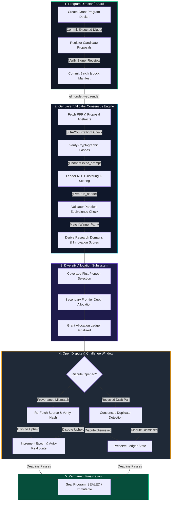

# SynapseGrant: Autonomous DeSci Research Grant & Proposal Diversity Allocator

[](https://studio.genlayer.com)
[](https://explorer-studio.genlayer.com)
[](LICENSE)
[](#)

> **Autonomous AI-Consensus Protocol for Transparent, Diversity-Preserving Research Grant Allocation on GenLayer.**

### 📍 Live Studionet Deployment
- **Contract Address**: `0x257dF49DFADc9f1e88e2FD25FB7b2EF445299977`
- **Network**: GenLayer Studionet (`chainId: 61999`)
- **RPC Endpoint**: `https://studio.genlayer.com/api`


---

## 🐉 Dragon Architecture & Protocol Flow



---

## 1. The Core Trust Problem

Scientific research grant committees (DeSci DAOs, research foundations, and open innovation funds) regularly face the **Allocator's Dilemma**:
1. **High Inflow, Low Capacity:** A grant round may offer 4 to 6 funding tranches but receive dozens of competitive proposals.
2. **Institutional Bias & Review Cartels:** Centralized reviewers frequently favor prestigious affiliations or conservative paradigms, starving novel high-risk high-reward frontier science.
3. **Plagiarism & Proposal Farming:** Sybil applicants submit slightly rephrased or recycled drafts to game scoring systems.

Traditional EVM smart contracts cannot solve this because they cannot inspect external, unstructured scientific abstracts or perform semantic categorization without relying on centralized oracles. Conversely, off-chain review backends reintroduce single points of failure, opacity, and censorship.

---

## 2. Why GenLayer is Essential

SynapseGrant leverages GenLayer's **Intelligent Contract** architecture to achieve verifiable, trustless grant allocation:
- **Non-Deterministic Evidence Fetching:** Validators use `gl.nondet.web.render` to independently retrieve proposal abstracts from external open-access URLs and verify their SHA-256 cryptographic digests against on-chain precommitments.
- **Multi-Validator AI Thematization:** Validators execute LLM inference (`gl.nondet.exec_prompt`) to group proposals into thematic research domains, compute innovation scores (1–100), and detect recycled drafts.
- **Equivalence Principle Normalization:** Instead of brittle string matching on LLM output prose, consensus is achieved by validating semantic comment group partitions (`domain_members`), score tolerances (±10 points), and strict 100% agreement on downstream grant winners.
- **Open Dispute Tribunal:** Anyone can file a provenance or recycled-draft challenge during the dispute window. If upheld by validator consensus, the contract increments the program epoch, excludes the bad proposal, and deterministically recomputes grant allocations on-chain.

---

## 3. Comprehensive Actor Journeys

### 🏛️ Program Director
1. Connect authorized EVM wallet (MetaMask, OKX, or Rabby) on GenLayer Studionet.
2. Initialize grant program with RFP URL, RFP digest, expected docket manifest hash, grant count, and deadlines.
3. Register submitted researcher proposals and lock the batch via `commit_docket`.
4. Trigger permissionless consensus thematization and allocation.
5. Seal the program permanently after the dispute window expires.

### 🔬 Research Applicant
1. Submit scientific abstract and methodology to open access repository.
2. Receive a cryptographically bound `submission_receipt` linking proposal ID, URL, content SHA-256, and program ID.
3. Track real-time frontier domain clustering and ranking on the live dashboard.

### ⚖️ Reviewer & Challenger
1. Inspect committed proposal abstracts and allocated rosters.
2. Open a `SOURCE_PROVENANCE_MISMATCH` or `RECYCLED_DRAFT_PAIR` dispute if an abstract differs from source or duplicates an existing proposal.
3. Consensus automatically reviews evidence: upheld disputes update the epoch and trigger fair re-allocation.

---

## 4. Contract State Machine Lifecycle

```text
[ACCEPTING] ──> [COMMITTED] ──> [THEMATIZED] ──> [ALLOCATED] ──> [CHALLENGE] ──> [SEALED]
     │
     └──> [ABORTED] (Pre-lock recovery path)
```

---

## 5. Security & Trust Boundaries

- **Strict Delimiter Validation:** IDs, URLs, and digests are screened for pipe characters (`|`), control codes, and whitespace to prevent manifest delimiter collision attacks.
- **Cryptographic Admission Receipts:** Each admitted proposal requires a matching hash bound to the authorized director key.
- **EIP-6963 Zero-Persistence Wallet Layer:** The frontend binds exclusively to the selected provider object with strict RDNS allowlisting and stores zero private data.
- **Isolated State Mutation:** Dispute adjudication operates on cloned state copies, ensuring transient node failures fail closed without corrupting stored records.

---

## 6. Local Development & Testing

```bash
# Contract Tests (Pytest)
python3 -m pytest tests -v

# Frontend Development
cd frontend
npm install
npm run dev
```

---

## 7. License

MIT License. Engineered for the GenLayer Ecosystem.
